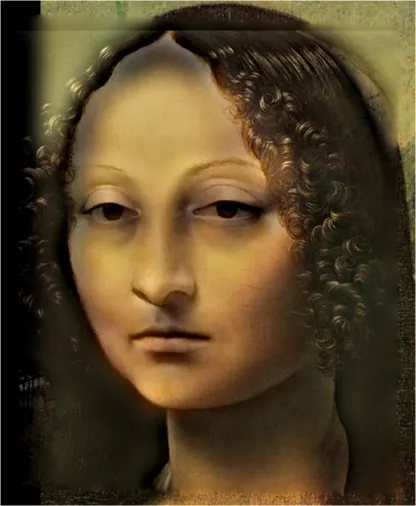

# Assignment 2 - DIP with PyTorch

This repository contains the implementation for the second digital image processing assignment:

- Task 1: Traditional DIP, Poisson Image Editing
- Task 2: Deep learning DIP, Pix2Pix with FCN

## Resources

- [Assignment Slides](https://pan.ustc.edu.cn/share/index/66294554e01948acaf78)
- [Poisson Image Editing](https://www.cs.jhu.edu/~misha/Fall07/Papers/Perez03.pdf)
- [Image-to-Image Translation with Conditional Adversarial Nets](https://phillipi.github.io/pix2pix/)
- [Fully Convolutional Networks for Semantic Segmentation](https://arxiv.org/abs/1411.4038)

## Requirements

Recommended environment setup:

```bash
conda create -n dip_hw2 python=3.13 -y
conda activate dip_hw2
pip install torch gradio opencv-python pillow numpy
```

For the Pix2Pix dataset script, `bash`, `wget`, and `tar` need to be available.

## Training

### Task 1: Poisson Image Editing

Run the Gradio demo:

```bash
python run_blending_gradio.py
```

Then:

1. Upload the foreground image.
2. Click points to draw a polygon.
3. Click `Close Polygon`.
4. Upload the background image.
5. Adjust `dx` and `dy`.
6. Click `Blend Images`.

### Task 2: Pix2Pix

Run the following commands inside the `Pix2Pix/` folder:

```bash
bash download_facades_dataset.sh
python train.py
```

Training uses the Facades dataset. The script saves checkpoints every 50 epochs and saves visual comparison images into `train_results/` and `val_results/` every 5 epochs.

## Evaluation

### Task 1

Evaluate visually through the Gradio demo. The result should be a seamless blend inside the selected polygon region.

### Task 2

Run `python train.py` inside `Pix2Pix/` to train the FCN generator on the Facades dataset.
The script will save checkpoints and visual comparison images locally during training.
Those generated artifacts are intentionally not committed in this lightweight upload.

## Pre-trained Models

No pre-trained checkpoint is included in this lightweight version of the repository.
If you run the training script locally, the final checkpoint will be saved under `Pix2Pix/checkpoints/`.

## Results

### Task 1: Poisson Image Editing

The following example uses the Monalisa pair and the provided blended result.

| Source | Target | Result |
|---|---|---|
|  |  |  |

### Task 2: Pix2Pix

The Pix2Pix training artifacts are not stored in this upload.
Run `Pix2Pix/train.py` locally to generate checkpoints and comparison images.

## Contributing

This repository is for coursework only. If you reuse the code, keep the original assignment context and paper references.

## License

No separate license file is provided. Use it for course work and study only.
