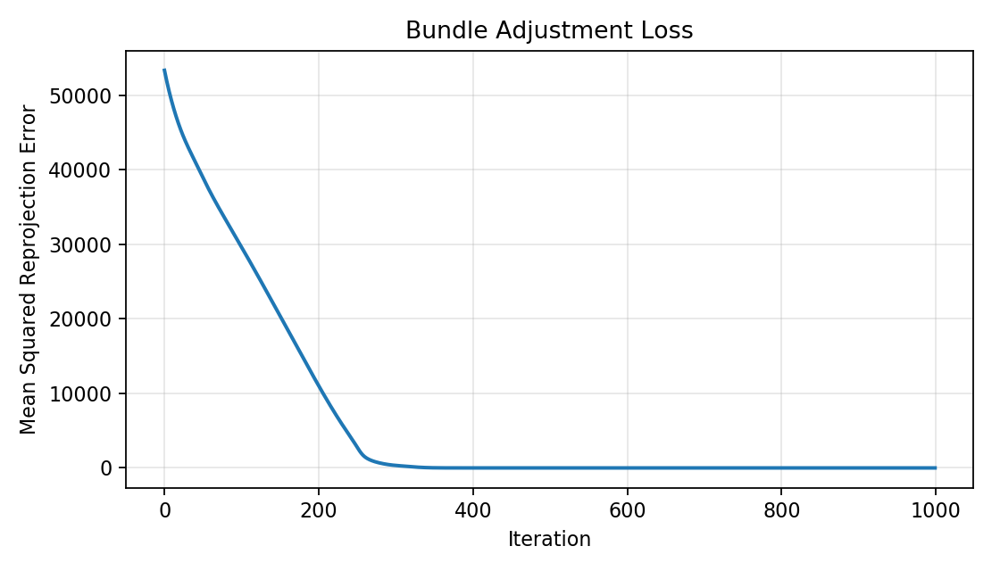
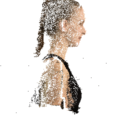
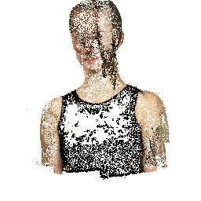

# Assignment 3 - Bundle Adjustment 报告

## 实验环境

- 操作系统：Windows + WSL
- 运行时：Python、PyTorch、COLMAP
- 输入数据：`data/`
- 输出结果：`outputs/task1/`、`data/colmap/`

## Task 1: PyTorch 实现 Bundle Adjustment

### 任务目标

根据 50 个视角下的 2D 观测点，联合优化：

- 共享焦距 `f`
- 每个视角的外参 `R, T`
- 所有 3D 点坐标

### 方法

#### 1. 投影函数

先将 3D 点变换到相机坐标系：

$$
[X_c, Y_c, Z_c]^T = R [X, Y, Z]^T + T
$$

再投影到像素坐标：

$$
u = -f \cdot X_c / Z_c + c_x,\quad v = f \cdot Y_c / Z_c + c_y
$$

#### 2. 优化目标

最小化 2D 重投影误差：

$$
L = \frac{1}{N} \sum_i \lVert \hat{p}_i - p_i \rVert_2^2
$$

#### 3. 参数化与优化

- 旋转使用 Euler 角参数化
- 焦距使用 `log_f` 优化，保证始终为正
- 优化器使用 Adam
- 3D 点和外参同时优化

#### 4. 初始化

- 相机初始朝向：按视角范围设置 yaw 初值
- 平移初值：`[0, 0, -d]`
- 3D 点初值：原点附近随机扰动
- 焦距初值：由视场角估算

### 结果

- 迭代次数：`1000`
- 最终 loss：`0.5113`
- 最小 loss：`0.3868`
- 最终焦距：`958.23`

loss 变化曲线如下：



最终重建点云已保存为带颜色的 OBJ：

- [outputs/task1/reconstruction.obj](outputs/task1/reconstruction.obj)

OBJ 中每行格式为：

```text
v x y z r g b
```

颜色直接读取自 `points3d_colors.npy`。

### 输出文件

- [outputs/task1/loss_curve.png](outputs/task1/loss_curve.png)
- [outputs/task1/reconstruction.obj](outputs/task1/reconstruction.obj)
- [outputs/task1/result.npz](outputs/task1/result.npz)

---

## Task 2: 使用 COLMAP 完成三维重建

### 任务流程

1. 特征提取
2. 特征匹配
3. 稀疏重建
4. 稠密重建
5. 结果展示

### 方法

完整流程由 [run_colmap.sh](run_colmap.sh) 统一调度：

```bash
bash run_colmap.sh
```

#### 1. 特征提取

对 `data/images/` 下的 50 张图像提取局部特征，并写入 `database.db`。

#### 2. 特征匹配

使用 exhaustive matcher 完成全连接匹配。

#### 3. 稀疏重建

使用 COLMAP 的 `mapper` 完成稀疏重建，本质上也是一次内部 Bundle Adjustment。

- 注册图像数：`50`
- 稀疏点数：`1706`

#### 4. 稠密重建

按如下顺序执行：

- `image_undistorter`
- `patch_match_stereo`
- `stereo_fusion`

为了减少衣服胸口区域的空洞，最终采用了更宽松的融合设置：

- `PatchMatchStereo.max_image_size = 2000`
- `PatchMatchStereo.geom_consistency = false`
- `stereo_fusion --input_type photometric`
- `StereoFusion.min_num_pixels = 3`

最终稠密点云点数为：

- `176224`

### 结果展示

稠密重建截图如下：





如果需要查看旋转展示，可以直接打开：

- [data/colmap/dense/fused_preview.gif](data/colmap/dense/fused_preview.gif)

### 输出文件

- [data/colmap/database.db](data/colmap/database.db)
- [data/colmap/sparse/0/](data/colmap/sparse/0/)
- [data/colmap/dense/fused_preview.png](data/colmap/dense/fused_preview.png)
- [data/colmap/dense/fused_preview.gif](data/colmap/dense/fused_preview.gif)

---

## 结论

- Task 1 已完成 Bundle Adjustment 的完整实现，并得到稳定收敛结果。
- Task 2 已完成 COLMAP 的稀疏与稠密重建，并输出可用于报告展示的点云截图。
